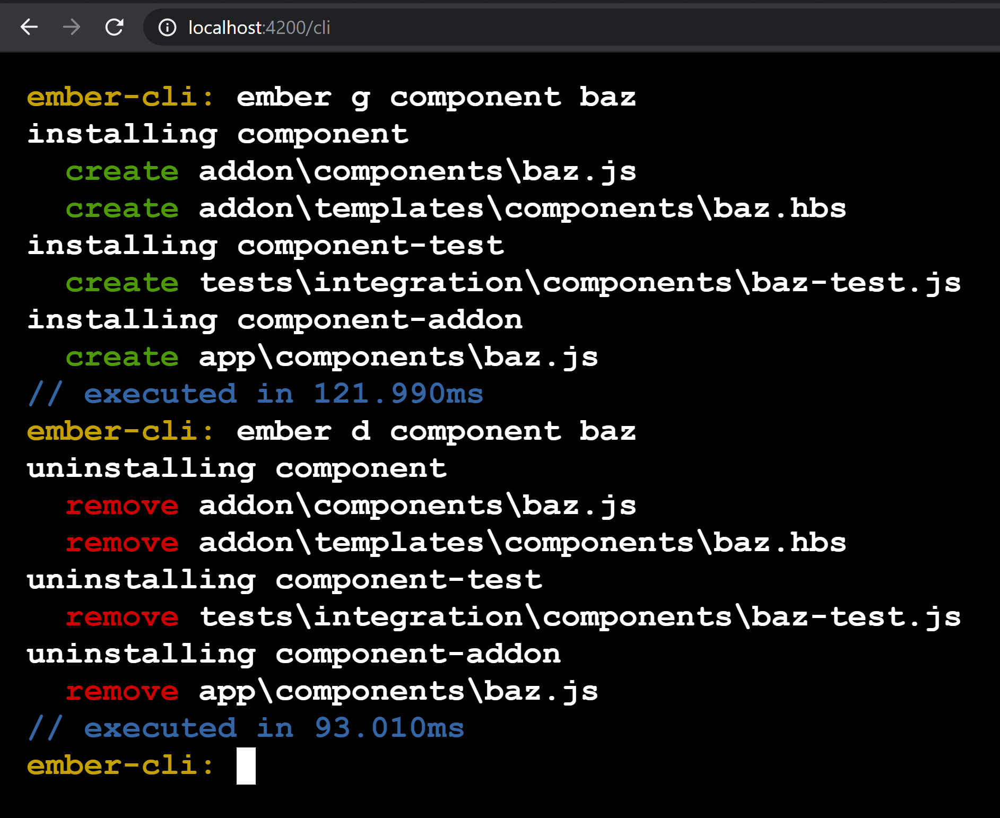

ember-fast-cli
==============================================================================

This addon allow execute cli commands on running `ember-cli` instance.

`ember-cli` commands execution relatively slow, because we need to `revalidate` all dependencies and `initialize` all addons on each command execution (we have to boot full `cli` to execute any blueprint).

It may take up to `5-20s` to generate component using `ember g component foo-bar`.

But, if we will execute commands on already started cli (development server, running by `ember s`), we can get __500x__ boost on `cli` performance, for my case component generation time reduced from `10s` to `0.2s`.





Compatibility
------------------------------------------------------------------------------

* Ember.js v3.4 or above
* Ember CLI v2.13 or above
* Node.js v8 or above


Installation
------------------------------------------------------------------------------

```
ember install ember-fast-cli
```


Usage
------------------------------------------------------------------------------

<details>
  <summary>How to run addon with `ember-cli < 3.16.0`</summary>
  
edit `node_modules/ember-cli/lib/cli/index.js` and add one line

```js
cli.env = environment; // <-- we need to add this line
```

[here:](https://github.com/ember-cli/ember-cli/blob/7d80dbf3a28f23044c1c7544db6f7ca3792185a3/lib/cli/index.js#L145)


```js
  let environment = {
    tasks: loadTasks(),
    cliArgs: options.cliArgs,
    commands: loadCommands(),
    project,
    settings: merge(defaultUpdateCheckerOptions, config.getAll()),
  };

  cli.env = environment; // <-- we need to add this line

  return cli.run(environment).finally(() => willInterruptProcess.release());
```

</details>


After you have started your development server using `ember serve`, this addon adds a custom middleware listening to `/cli` endpoint. 

So just open [http://localhost:4200/cli](http://localhost:4200/cli) in your web browser to access `fast-cli`.

type: `g component foo-bar` + Enter

Check files! Repeat if you enjoying it. Star if you like it! :)


Also, `ember-fast-cli` working with [Unstable Ember Language Server](https://marketplace.visualstudio.com/items?itemName=lifeart.vscode-ember-unstable), and allow developers to execute `ember-cli` commands from `vscode` command interface. Open `vscode` command line and search for `Ember`.

Contributing
------------------------------------------------------------------------------

See the [Contributing](CONTRIBUTING.md) guide for details.


License
------------------------------------------------------------------------------

This project is licensed under the [MIT License](LICENSE.md).
